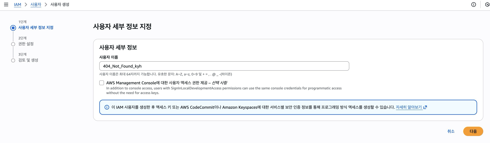
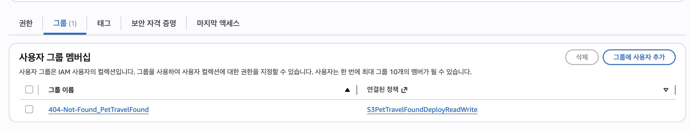
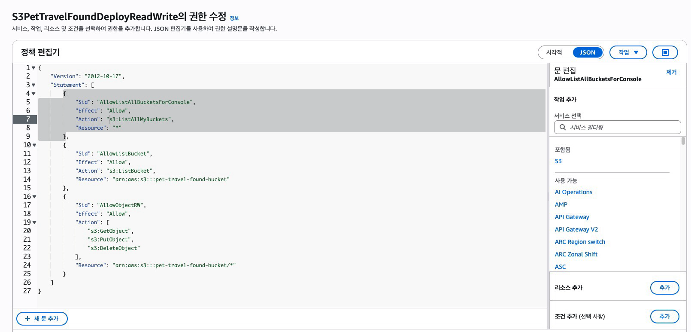
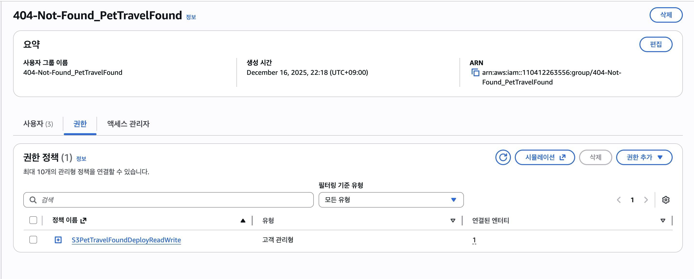
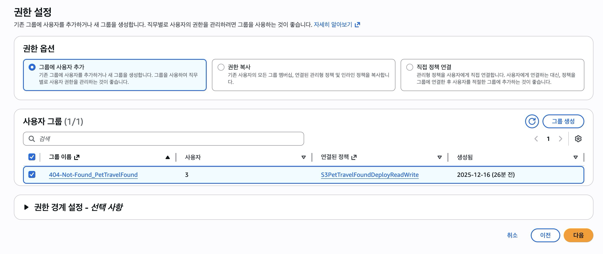
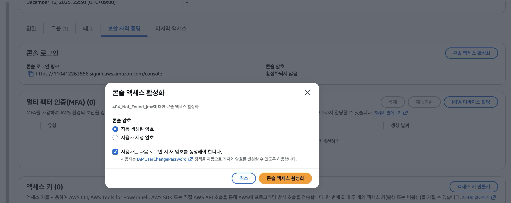

# S3 배포용 IAM 계정 및 권한 구성 작업 문서

## 1. 목적

본 문서는 **프로젝트 배포용 S3 버킷에 대한 접근 권한을 팀원에게 안전하게 제공하기 위해**
IAM 사용자 생성, 사용자 그룹 구성, S3 접근 정책을 설계·적용한 작업 내용을 정리한 문서입니다.

최소 권한 원칙(Least Privilege)을 기준으로, **특정 S3 버킷에 대해서만 읽기/쓰기 권한을 허용**하도록 구성했습니다.

---

## 2. 전체 작업 흐름

```
IAM 사용자 생성
        ↓
IAM 사용자 그룹 생성
        ↓
S3 접근 정책 작성 (특정 버킷 제한)
        ↓
사용자 그룹에 정책 연결
        ↓
IAM 사용자를 그룹에 추가(최초 로그인 시 별도 암호 전달 필요)
        ↓
IAM 사용자에서 보안 자격 증명 탭에 있는 콘솔 로그인 엑세스 활성화(랜덤 암호 발급)
        ↓
IAM 사용자에서 보안 자격 증명 탭에 있는 콘솔 로그인 엑세스 활성화(랜덤 암호 발급)
```

---

## 3. IAM 사용자 생성

### 3.1 사용자 생성 목적

- 팀원이 **AWS 콘솔을 통해 S3 배포 버킷에 접근**할 수 있도록 IAM 사용자 계정 생성
- 루트 계정 공유 없이 개인별 접근 이력 관리

### 3.2 생성 방식

- AWS Console → IAM → Users → Create user
- 사용자 이름: `<예: 404_Not_Found_kyh>`
- Access type:
  - ☑️ AWS Management Console access
  - (필요 시) Access key는 별도 생성



---

## 4. IAM 사용자 그룹 생성

### 4.1 그룹 생성 목적

- 사용자 개별 권한 부여가 아닌 **그룹 기반 권한 관리**
- 팀원 추가/삭제 시 권한 관리 단순화

### 4.2 그룹 정보

- **그룹 이름**: `404-Not-Found_PetTravelFound`
- 용도: 프로젝트 배포용 S3 버킷 읽기/쓰기 권한 관리



---

## 5. S3 접근 정책 작성

### 5.1 정책 생성 목적

- 전체 S3 접근이 아닌 **특정 배포용 S3 버킷만 접근 허용**
- 읽기(Get), 업로드(Put), 삭제(Delete) 권한만 부여

### 5.2 정책 정보

- **정책 이름**: `S3PetTravelFoundDeployReadWrite`
- 적용 대상: 특정 프로젝트 배포용 S3 버킷

### 5.3 정책 내용

```json
{
  "Version": "2012-10-17",
  "Statement": [
    {
      "Sid": "AllowListAllBucketsForConsole", // 계정에 존재하는 S3 버킷 목록 조회
      "Effect": "Allow",
      "Action": "s3:ListAllMyBuckets",
      "Resource": "*"
    },
    {
      "Sid": "AllowListBucket",
      "Effect": "Allow",
      "Action": "s3:ListBucket",
      "Resource": "arn:aws:s3:::pet-travel-found-bucket"
    },
    {
      "Sid": "AllowObjectRW",
      "Effect": "Allow",
      "Action": [
        "s3:GetObject",
        "s3:PutObject",
        "s3:DeleteObject"
      ],
      "Resource": "arn:aws:s3:::pet-travel-found-bucket/*"
    }
  ]
}

```



---

## 6. 사용자 그룹에 정책 연결

### 6.1 작업 내용

- IAM 그룹 `404-Not-Found_PetTravelFound`에
- 정책 `S3PetTravelFoundDeployReadWrite` 연결

이를 통해 그룹에 속한 모든 사용자는
해당 S3 버킷에 대해 동일한 접근 권한을 가짐



---

## 7. IAM 사용자를 그룹에 추가

### 7.1 작업 내용

- 생성한 IAM 사용자를 `S3ProjectDeployRW` 그룹에 추가
- 사용자에게 직접 정책을 부여하지 않고 **그룹을 통해 권한 상속**



---

## 8. 콘솔 로그인 설정

### 8.1 비밀번호 설정

- IAM 사용자 생성 시 비밀번호를 설정하지 않았으므로
- 이후 `Security credentials` 메뉴에서 **Console access 활성화**
- 임시 비밀번호 설정 및 최초 로그인 시 변경 강제



---

## 9. 결과

- 팀원은 **IAM 전용 로그인 URL**을 통해 AWS 콘솔 로그인 가능
- 프로젝트 배포용 S3 버킷에 대해서만 접근 가능
- 다른 AWS 리소스 및 S3 버킷에는 접근 불가

---

## 10. 정리

- IAM 사용자 / 그룹 / 정책을 분리하여 관리
- 최소 권한 원칙 기반의 안전한 S3 접근 구조 구성
- 향후 사용자 추가/삭제 및 권한 확장에 유연하게 대응 가능
